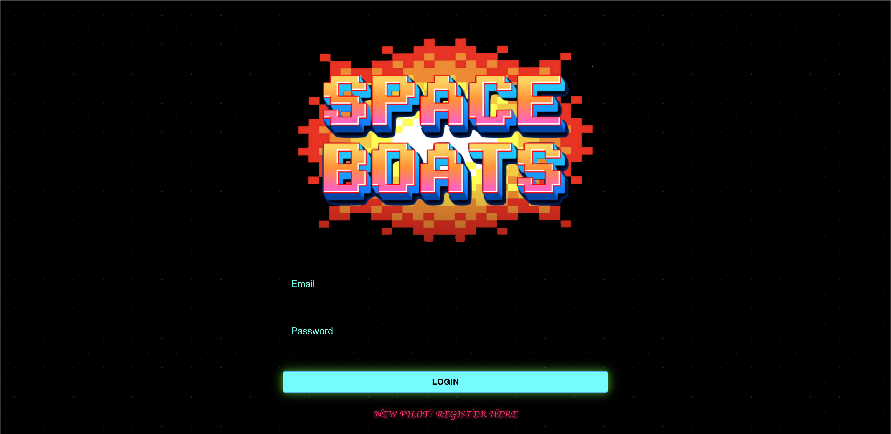

# SPACE-BOATS

## Description
Travel back in time in this retro-inspired shooter arcade game. Pilot your space craft in a futuristic battlefield where fast reflexes and strategic maneuvers are key to surviving intense duels and cooperative challenges. Whether you're competing against friends in Duel mode or teaming up in Co-Op battles, Space Boats delivers a nostalgic yet fresh arcade experience for people of all ages. Prepare for high-speed action, strategic gameplay, and endless excitement in outer space!

## Table of Contents
- [Description](#description)
- [Technologies](#technologies)
- [Links](#links)
- [Questions](#questions)

## Technologies
- JavaScript
- TypeScript
- Node.js
- Python
- React

## Links
- [GitHub Repo](https://github.com/LPerez21/SPACE-BOATS)
- [Render](https://space-boats-front.onrender.com/)

## Questions
Should you have questions, please reach us via GitHub:
- [Luis Perez](https://github.com/LPerez21)
- [Jose Ornelas](https://github.com/jaornelas)
- [Ernesto Aleman](https://github.com/Bakenavva)
- [Saher Shaikh](https://github.com/saher-wrld)
- [Joseph Sanchez](https://github.com/jsanc33)
- [Aditya "Deets" Bhonsle](https://github.com/deetsb)